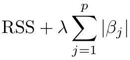

```{r echo=FALSE, message=FALSE, warning=FALSE}
library(tidyverse) # Librería para ordenamiento de arreglos de datos, incluye ggplot2
library(Metrics) # Librería para calculo de métricas de evaluación valores reales vs valores predichos
library(plotly) # gráficos interactivos
library(glmnet) # Incluye las funciones necesarias para generar metodos de regularización
```

```{r echo=FALSE, message=FALSE, warning=FALSE}
# Carga de datos actualizados en la parte anterior
Train <- as.data.frame(read_csv("Train.csv", col_types = cols(chas = col_factor()
                                                , rad = col_factor())))
Test <- as.data.frame(read_csv("Test.csv", col_types = cols(chas = col_factor(), 
                                              rad = col_factor())))
RMSE_4 <- read_csv("RMSE_3.csv")
```

```{=html}
<center>
<h1>Parte 5: Regularización</h1>
</center>
```
## Introducción

En los modelos de regresión que se han planteado se han contemplado únicamente modelos lineales; en este orden de ideas, se presenta los dos últimos modelos de este orden, los cuales corresponden a métodos de regularización, estos parten del modelo de regresión lineal al que se adiciona un factor de contracción. Las regresiones Ridge (L2) y Lasso (L1) son los métodos de regularización que se soportan en la minimización del RSS (Suma de residuos al cuadrado) al cual se le agrega un factor de penalización (o factor de contracción). El soporte matemático del método de regularización no es objeto del presente documento, sin embargo, una fuente recomendada para consultar o conocer el soporte teórico se encuentra en el la sección 6.2 del libro [An Introduction to Statistical Learning](https://www.statlearning.com/) Segunda edición, de los autores *James, G., Witten, D., Hastie, T., & Tibshirani.*

El desarrollo de esta parte del documento se soporta también en la sección 6.5.2 del libro ya mencionado; en este se recomienda el uso del método "validación cruzada tipo k-fold" con el fin de encontrar el factor de penalización que presente el mínimo de error en el modelo. Adicionalmente, se destaca que se hace uso de la librería "glmnet".

### 5.1. Validación cruzada tipo k-fold

R.Chollet, F., & Allaire, J. J en su libro [Deep Learning with R](https://www.manning.com/books/deep-learning-with-r) mencionan que cuando un conjunto de datos no tiene una cantidad considerable de observaciones es recomendable hacer uso de la validación cruzada. No es muy claro (por lo menos en mi caso, no he encontrado una "formula" que me permita conocer el dato) cuál es la cantidad de observaciones óptima para concluir que son suficientes para trabajar únicamente con los subconjuntos Train y Test. La literatura si menciona que se debe procurar un "equilibrio" entre la cantidad de dimensiones (variables) y la cantidad de observaciones. Si se plantea que tenemos alrededor de 39 observaciones por cada variable (incluida la dependiente) se podría concluir que son muy pocas ya que en el libro en mención, en la sección 4.3.4, se dice que este conjunto de datos (Boston) posee muy pocas observaciones, y que plantear un subconjunto de validación (Test) con 100 observaciones (en promedio) es insuficiente, pues podría suceder que este subconjunto no represente adecuadamente el nivel de varianza que incluye el conjunto de entrenamiento (Train) y viceversa. En aquellos modelos de regresión en lo que se requiere encontrar el el optimo de uno o varios parámetros de tal manera que se minimice el error total del modelo,y que a su vez se tengan pocas observaciones, debería hacerse uso de la validación cruzada.

Existen varios métodos de validación cruzada, no obstante, para este planteamiento se usará la validación cruzada tipo k-fold, este consiste en dividir el conjunto de entrenamiento en k "pliegues" a fin de entrenar el modelo k veces, cada k entrenamiento entregará un valor de error (según la métrica de evaluación seleccionada), al final se hará un promedio de los k errores y este será el error de entrenamiento. En cada k entrenamiento se usa uno de los k pliegues para validar el entrenamiento que se hace con los k-1 pliegues restantes. Para un valor K = 5 lo anterior se observaría así:

{width="399" height="181"}

```{r echo=FALSE, message=FALSE, warning=FALSE}
Xt <- model.matrix(medv~., Train)[,-1] # Matriz para modelo lineal, convierte variables categóricas en dummy, se elimina la columna de intercepto que se crea
Yt <- as.matrix(Train[,13])
```

### 5.2. Regresión Ridge (L2)

El método de regularización ridge (L2) incluye, como factor de penalización en el RSS, la sumatoria de los coeficientes (de cada variable) al cuadrado y multiplicado por un valor lambda. En este método no se presenta "eliminación" de variables, para aquellas variables no influyentes el resultado de la aplicación de la penalización reduce el valor del coeficiente pero no se excluye, esto es, el resultado final va a incluir todas las variables independientes.

{width="105" height="43"}

Para 100 valores lambda que están entre 0,001 y 100.000, los coeficientes de cada modelo (100) modelos se comportan como se observa en la siguiente gráfica:

```{r echo=FALSE, message=FALSE, warning=FALSE}
set.seed(2023)
grid = grid <- 10^ seq (5 , -2 , length = 100)
lm_ridge <- glmnet(x = Xt, y = Yt, alpha = 0, lambda = grid,standardize = FALSE) # Alpha = 0 para regularización tipo ridge
Coeficientes <- as.data.frame(t(as.matrix(coef(lm_ridge))))
Coeficientes <- data.frame(Coeficientes[,-1],Lambda = lm_ridge$lambda)
Coeficientes$LogLambda = log(Coeficientes$Lambda)
Lineas <- names(Coeficientes)
```

```{r echo=FALSE, message=FALSE, warning=FALSE}
# Creación del objeto gráfico
fig_ridge_lamda <- plot_ly(data = Coeficientes, x = ~LogLambda)
# Bucle para agregar los trazados, uno por cada variable
i = 1
while (i <= (ncol(Coeficientes)-2)){
  fig_ridge_lamda <- fig_ridge_lamda %>% add_trace(y = Coeficientes[,i],
                                                   mode = 'lines',
                                                   name = Lineas[i],
                                                   type = "scatter")
  i = i + 1
}
fig_ridge_lamda <- fig_ridge_lamda %>% layout(title = list(text ='Ridge(L2) - Coeficientes Vs Lambda',
                                                           y = 0.97, x = 0.1),
                                              xaxis = list(title = 'log(Lambda)'),
                                              yaxis = list(title = 'Coeficientes no estandarizados'), 
                                              legend = list(orientation = 'h', 
                                                            x = 0, y = -0.3) 
)
#Presentar el objeto
fig_ridge_lamda
```

Cuando el valor de lambda es pequeño la dispersión de los coeficientes se hace más evidente para las variables *nox* y *rm*, no obstante la primera desciende rápidamente a medida que el lambda se acerca a 1, el caso de *rm* tiene un descenso importante para un lambda mayor a 1. Para el resto de variables los valores de los coeficientes se mantienen menos dispersos. Los valores de los coeficientes (o el lambda adecuado) que minimiza el error se obtiene mediante el cálculo del error medio cuadrado haciendo uso de la validación cruzada. Algunas de las variables que se desprenden de *rad* presentan un leve aumento en el valor de sus coeficientes para valores de lambda entre 0.02 y 0.1 y decaen hasta encontrar coeficientes cercanos a cero

Con un número de fols de 5 en la validación cruzada y los mismo valores lambda ya, el error cuadrado medio se observa así:

```{r echo=FALSE, message=FALSE, warning=FALSE}
lm_ridge_cv <- cv.glmnet(x = Xt, y = Yt, alpha = 0, 
                      nfolds = 5,standardize = FALSE,
                      lambda = grid) # Alpha = 0 para regularización tipo ridge
mse_ridge <- data.frame(LogLambda =log(grid),
                        Lambda = grid, 
                        MSE=lm_ridge_cv[["cvm"]],
                        SD=lm_ridge_cv[["cvsd"]])
fig_mse_ridge <- plot_ly(data = mse_ridge,x=~LogLambda, y=~MSE,
                         type = "scatter", mode = 'markers',
                         marker=list(color='red'),
                         error_y = ~list(array = SD,
                                         color = '#7f7f7f'))
fig_mse_ridge <- fig_mse_ridge %>% layout(title = list(text ='Ridege(L2) - Comparación de Error Cuadrático Medio',
                                                           y = 0.97, x = 0.1),
                                              xaxis = list(title = 'log(Lambda)'),
                                              yaxis = list(title = 'Error Cuadrático Medio')
                            ) 
fig_mse_ridge
bestlam <- lm_ridge_cv$lambda.min
```

El menor MSE encontrado alcanza un valor de 25.83 con una desviación estándar de 4.08, el cual se encuentra para el valor lambda más bajo de los seleccionados, esto es, 0.01.

El modelo de regresión lineal múltiple con la regularización L2 con lambda de 0.01 se presenta así:

```{r echo=FALSE, message=FALSE, warning=FALSE}
predict(lm_ridge, s = bestlam ,type = "coefficients")[1:20,]
```

En este modelo, los coeficientes toman el valor más alto dentro de los 100 planteados (uno para cada valor lambda). La predicción de los valores para medv y su comparación con los valores reales se observaría de la siguiente manera:

```{r echo=FALSE, message=FALSE, warning=FALSE}
Xtest <- model.matrix(medv~., Test)[,-1]
Ytest <- as.matrix(Test[,13])
pred_L2 <- predict(lm_ridge, s = bestlam, newx = Xtest)
data_reg <- data.frame(Test, pred_L2)
nombres = c(names(Test),"Predict_medv_L2")
names(data_reg) <- nombres
rm(nombres)
data_reg <- rownames_to_column(data_reg,"Ind")
data_reg$Ind <- as.numeric(data_reg$Ind)
data_reg<- arrange(data_reg,medv)
data_reg <- rownames_to_column(data_reg,"Obs")
data_reg$Obs <- as.numeric(data_reg$Obs)
```

```{r echo=FALSE, message=FALSE, warning=FALSE}
fig_L2 <- plot_ly(data = data_reg, x = ~Obs)
fig_L2 <- fig_L2 %>% add_trace(y = ~medv, # Agregar trazado de datos reales
                              mode = 'lines+markers',
                              name = 'medv_real',
                              type="scatter")
fig_L2 <- fig_L2 %>% add_trace(y = ~Predict_medv_L2, # Agregar trazado de datos predicción
                              mode = 'lines+markers',
                              name = 'medv_predicción_L2',
                              type="scatter",
                              line=list(color='indianred'),
                              marker=list(color='indianred'))
fig_L2 <- fig_L2 %>% layout(title = list(text ='Regularización L2',
                                                     y = 0.97, x = 0.1),
                                        xaxis = list(title = 'Observación'),
                                        yaxis = list(title = 'medv'))
fig_L2
```

En términos generales, los resultados de la predicción se observan por encima de los valores reales con una tendencia a quedarse por debajo9 cuando el valor medv real es de 38. Con lo observado gráficamente, el resultado de este modelo no será mejor que los analizados hasta el momento, en especial los modelos que incluyen interacciones entre variables.

### 5.3. Regresión Lasso (L1)

Al igual que el modelo L2, Lasso (Least Absolute Shrinkage and Selection Operator) incluye un factor de penalización en el RSS: la sumatoria del valor absoluto de los coeficientes (de cada variable) multiplicado por un valor lambda. Dada la configuración de este factor de penalización, se da la posibilidad que exista "eliminación" de variables no influyentes.

{width="112" height="54"}

Se hace uso de los mismos cien valores lambda planteados en L2 por lo cual también se tendrán cien modelos lineales con un comportamiento en los coeficientes tal como lo presenta la siguiente gráfica:

```{r echo=FALSE, message=FALSE, warning=FALSE}
set.seed(2023)
grid = grid <- 10^ seq (5 , -2 , length = 100)
lm_lasso <- glmnet(x = Xt, y = Yt, alpha = 1, lambda = grid,standardize = FALSE) # Alpha = 0 para regularización tipo ridge
Coeficientes <- as.data.frame(t(as.matrix(coef(lm_lasso))))
Coeficientes <- data.frame(Coeficientes[,-1],Lambda = lm_lasso$lambda)
Coeficientes$LogLambda = log(Coeficientes$Lambda)
Lineas <- names(Coeficientes)
```

```{r echo=FALSE, message=FALSE, warning=FALSE}
# Creación del objeto gráfico
fig_lasso_lamda <- plot_ly(data = Coeficientes, x = ~LogLambda)
# Bucle para agregar los trazados, uno por cada variable
i = 1
while (i <= (ncol(Coeficientes)-2)){
  fig_lasso_lamda <- fig_lasso_lamda %>% add_trace(y = Coeficientes[,i],
                                                   mode = 'lines',
                                                   name = Lineas[i],
                                                   type = "scatter")
  i = i + 1
}
fig_lasso_lamda <- fig_lasso_lamda %>% layout(title = list(text ='Lasso(L1) - Coeficientes Vs Lambda',
                                                           y = 0.97, x = 0.1),
                                              xaxis = list(title = 'log(Lambda)'),
                                              yaxis = list(title = 'Coeficientes no estandarizados'), 
                                              legend = list(orientation = 'h', 
                                                            x = 0, y = -0.3) 
)
#Presentar el objeto
fig_lasso_lamda

```

De manera similar a la regresión ridge, para el valor más bajo de Lambda los valores de los coeficientes son altos para *nox* y *rm*, no obstante decrecen de manera rápida ubicándose muy cerca de cero. Para un valor lambda de 1 ya se observan un número considerable de variables independientes que tienden a desaparecer del modelo de regresión lineal. Se destaca que en este caso las variables desglosadas *rad* pierden la tendencia a aumentar sus valores de coeficientes y luego a disminuir, a excepción de *rad3* entre valores lambda de 0.02 y 0.1 aproximadamente.

En cuanto al error cuadrado medio para cada una de las 100 opciones planteadas con L1, gráficamente se observan así:

```{r echo=FALSE, message=FALSE, warning=FALSE}
lm_lasso_cv <- cv.glmnet(x = Xt, y = Yt, alpha = 1, 
                      nfolds = 5,standardize = FALSE,
                      lambda = grid) # Alpha = 0 para regularización tipo ridge
mse_lasso <- data.frame(LogLambda = log(grid),
                        Lambda = grid, 
                        MSE=lm_lasso_cv[["cvm"]],
                        SD=lm_lasso_cv[["cvsd"]])
fig_mse_lasso <- plot_ly(data = mse_lasso,x=~LogLambda, y=~MSE,
                         type = "scatter", mode = 'markers',
                         marker=list(color='red'),
                         error_y = ~list(array = SD,
                                         color = '#7f7f7f'))
fig_mse_lasso <- fig_mse_lasso %>% layout(title = list(text ='Lasso(L1) - Comparación de Error Cuadrático Medio',
                                                           y = 0.97, x = 0.1),
                                              xaxis = list(title = 'log(Lambda)'),
                                              yaxis = list(title = 'Error Cuadrático Medio')
                            ) 
fig_mse_lasso
bestlam <- lm_lasso_cv$lambda.min
```

El comportamiento de los MSE es muy similar para el modelo L2 teniendo también como resultado el menor error cuando lambda es igual a 0.01, este es el menor valor de lambda dentro de los 100 valores entregados al modelo. el valor MSE es de 25.94 con una desviación estándar de 2.9. Si bien este error es ligeramente alto respecto al observado con L2, el valor de la desviación se reduce en algo más de una unidad.

Con estos resultados se establece el modelo L1 con un valor lambda de 0.01

```{r echo=FALSE, message=FALSE, warning=FALSE}
predict(lm_lasso, s = bestlam ,type = "coefficients")[1:20,]
```

Tres de las variables incluidas en el modelo tienen como coeficiente cero, esto es, se excluyen del modelo final, *rad3, rad7* y *rad8*, las cuales se deprenden de la variable global *rad* . El modelo definitivo para L1 tiene un total de 16 variables.

```{r echo=FALSE, message=FALSE, warning=FALSE}
pred_L1 <- predict(lm_lasso, s = bestlam, newx = Xtest)
data_reg<- arrange(data_reg,Ind)
nombres <- c(names(data_reg))
data_reg <- data.frame(data_reg, pred_L1)
nombres <- c(nombres,"Predict_medv_L1")
names(data_reg) <- nombres
rm(nombres)
data_reg<- arrange(data_reg,medv)
```

```{r echo=FALSE, message=FALSE, warning=FALSE}
fig_L1 <- plot_ly(data = data_reg, x = ~Obs)
fig_L1 <- fig_L1 %>% add_trace(y = ~medv, # Agregar trazado de datos reales
                              mode = 'lines+markers',
                              name = 'medv_real',
                              type="scatter")
fig_L1 <- fig_L1 %>% add_trace(y = ~Predict_medv_L1, # Agregar trazado de datos predicción
                              mode = 'lines+markers',
                              name = 'medv_predicción_L1',
                              type="scatter")
fig_L1 <- fig_L1 %>% layout(title = list(text ='Regularización L1',
                                                     y = 0.97, x = 0.1),
                                        xaxis = list(title = 'Observación'),
                                        yaxis = list(title = 'medv'))
fig_L1
```

El comportamiento de los datos de predicción de L1 tienen una tendencia similar al modelo L2, los datos de la predicción tienden a ubicarse por encima de los datos reales a excepción de los datos con valores de reales de medv superiores a 38 en los que la predicción genera un resultado evidentemente menor.

### 5.4. Comparación de modelos L1 y L2

Los resultados de las predicciones de L1 y L2 se observan en la siguiente gráfica

```{r echo=FALSE, message=FALSE, warning=FALSE}
fig_L1L2 <- plot_ly(data = data_reg, x = ~Obs)
fig_L1L2 <- fig_L1L2 %>% add_trace(y = ~medv, # Agregar trazado de datos reales
                              mode = 'lines+markers',
                              name = 'medv_real',
                              type="scatter")
fig_L1L2 <- fig_L1L2 %>% add_trace(y = ~Predict_medv_L2, # Agregar trazado de datos predicción
                              mode = 'lines+markers',
                              name = 'medv_predicción_L2',
                              type="scatter")
fig_L1L2 <- fig_L1L2 %>% add_trace(y = ~Predict_medv_L1, # Agregar trazado de datos predicción
                              mode = 'lines+markers',
                              name = 'medv_predicción_L1',
                              type="scatter")
fig_L1L2 <- fig_L1L2 %>% layout(title = list(text ='Regularización L1 y L2',
                                                     y = 0.97, x = 0.1),
                                        xaxis = list(title = 'Observación'),
                                        yaxis = list(title = 'medv'))
fig_L1L2
```

Los modelos presentan resultados prácticamente igual, las diferencias en cada observación son mínimas entre L1 y L2, con esto se espera entonces que los resultados de RMSE sean muy cercanos.

#### **5.4.1 Cálculo del RMSE**

```{r echo=FALSE, message=FALSE, warning=FALSE}
e_L1 <- round(rmse(data_reg$medv,data_reg$Predict_medv_L1),2)
e_L2 <- round(rmse(data_reg$medv,data_reg$Predict_medv_L2),2)
RMSE_4 <- as.data.frame(rbind(RMSE_4,e_L1,e_L2))
RMSE_4[,1] <- c("01_RLS_lstat","02_RLS_rm","03_RLM_12vars"
                ,"04_RLM_2vars","05_RLMI_2vars", "06_RLMI_3vars",
                "07_RLMI_4vars", "08_Reg_L1", "09_Reg_L2")
```

Los resultados de RMSE para de ambos modelos tienen una diferencia de 0.01 lo que ratifica lo visto gráficamente: ambos modelos presentan resultados prácticamente iguales, la diferencia radica en que la complejidad del modelo L1 es menor al eliminar tres de las variables. Al compararlos con los resultados de RMSE con los de los demás modelos de regresión lineal desarrollados hasta el momento, estos son considerablemente altos, siendo solo un poco menor a los errores obtenidos en los modelos de regresión lineal simple, con base en lo anterior se puede concluir que para el conjunto de datos los modelos de regularización no son los más adecuados.

El RMSE del modelo L1 se calcula en 5.30 mientras que en el modelo L2 el valor es de 5.29, como ya se mencionó la diferencia es de 0.01, lo que representa un valor de 10 dólares , valor que es insignificante recordando que los datos de la variable *medv* se manejan en miles de dólares.

```{r echo=FALSE, message=FALSE, warning=FALSE}
fig_rmse <- plot_ly(RMSE_4, x = ~Modelo, y = ~RMSE, 
                type = "scatter", 
                mode = "markers+lines")
fig_rmse <- fig_rmse %>% layout(xaxis = list(tickangle=-45))
fig_rmse
```

```{r echo=FALSE, message=FALSE, warning=FALSE}
write_csv(RMSE_4,"RMSE_4.csv")
```
