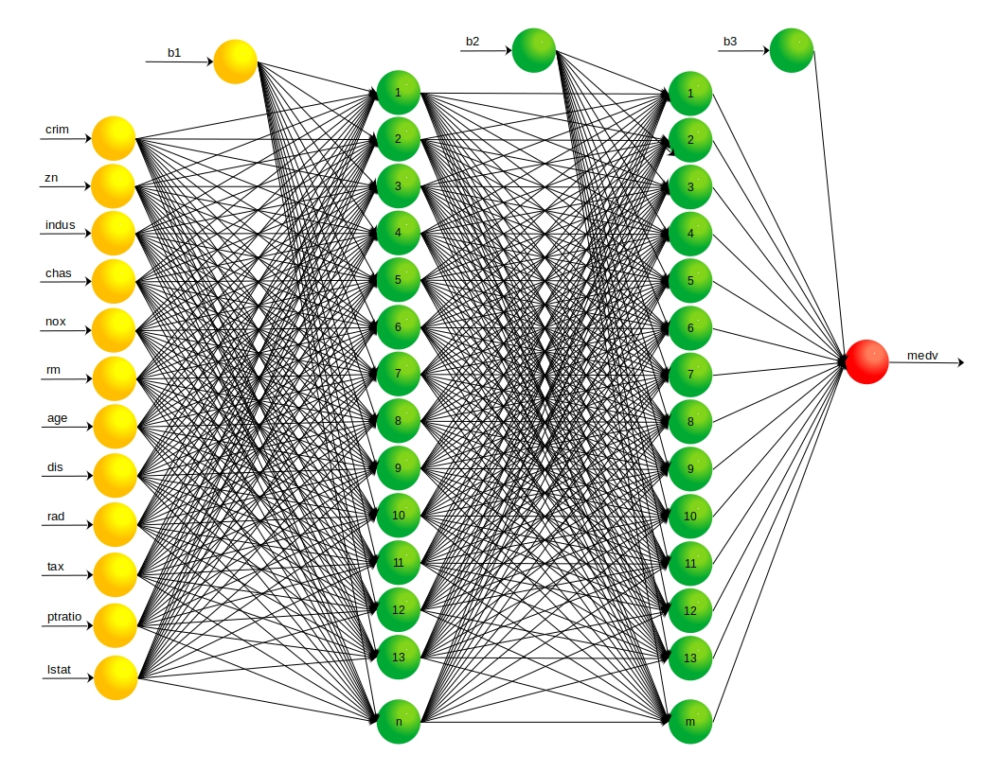

```{r echo=FALSE, message=FALSE, warning=FALSE}
set.seed(1983) # Semilla para replicabilidad
library(tidyverse) # Librería para ordenamiento de arreglos de datos, incluye ggplot2
library(Metrics) # Librería para calculo de métricas de evaluación valores reales vs valores predichos
library(plotly) # gráficos interactivos
library(cowplot) # Grid de gráficos
#library(reticulate) # hacer uso de python en R
library(keras) # 
library(tensorflow)
library(knitr) # Libería para crear tablas en archivos Knit html# gráficos interactivos
tensorflow::set_random_seed(1983)
```

```{r echo=FALSE, message=FALSE, warning=FALSE}
# Carga de datos actualizados en la parte anterior
Train <- as.data.frame(read_csv("Train.csv", col_types = cols(chas = col_factor()
                                                , rad = col_factor())))
Test <- as.data.frame(read_csv("Test.csv", col_types = cols(chas = col_factor(), 
                                              rad = col_factor())))
RMSE_7 <- read_csv("RMSE_6.csv")
```

```{=html}
<center>
<h1>Parte 8: Redes Neuronales Artificiales</h1>
</center>
```
## Introducción

Las redes neuronales artificiales (RNA) tienen aplicación a las regresiones numéricas, R.Chollet, F., & Allaire, J. J en su libro Deep Learning with R, mencionan la aplicación de las RNA a una regresión numérica presentando un ejemplo con el dataset Boston, el mismo que se ha usado a lo largo del documento. El desarrollo de esta parte del se basa en el ejercicio que se encuentra en el capítulo 4, numeral 4.3 del libro en mención. La explicación del soporte matemático y el funcionamiento de los modelos RNA puede ser un poco extensa, el númeral [3.1.2.1 Redes Neuronales Artificiales](https://repositorio.escuelaing.edu.co/handle/001/1262) del documento enlazado presenta un resumen de esta información.

La base de una red neuronal es conocida como perceptón, de allí parte la arquitectura de una red neuronal, [THE ASIMOV INSTITUTE](https://www.asimovinstitute.org/wp-content/uploads/2019/04/NeuralNetworkZo19High.png) tiene publicado un cuadro interesante de los tipos de arquitecturas de redes neuronales artificiales. Para esta parte del documento se contemplan modelos de RNA tipo Deep Feed Forward (DFF). En cada perceptón (neurona) se desarrolla una operación matemática que se puede esquematizar así:

{width="496"}

Cada perceptón tiene $m$ entradas, las cuales son las variables independientes a las que se les asigna un peso $W$. Cada peso $W_i$ está multiplicado por el valor de la variable de entrada, en el perceptón se produce la suma de todos los pesos y las entradas, y finalmente el resultado de la sumatoria pasa por una función de transferencia. La sumatoria mencionada es una versión de una regresión lineal simple, no obstante, la aplicación de la función de transferencia es la que "activa" una no linealidad del modelo. Un modelo RNA tiene $j$ perceptones, bien sea conectados directamente con las variables independientes o con las salidas de otro percepton, en todo caso en cada $j$ percepton se desarrolla una operación similar (cambian los pesos, las entradas y en algunos casos la función de transferencia). El modelo, durante el entrenamiento, ajusta los pesos $W$ hasta que encuentra el menor error posible.

{width="433"}

El anterior es un esquema del funcionamiento de un modelo de RNA, no obstante, es necesario tener en cuenta que el modelo es mucho más complejo, incluye hiper-parámetros que no se mencionan a profundidad pero que son relevantes en los resultados del modelo (cantidad de perceptones por cada capa, tasa de aprendizaje del optimizador, entre otros).

Los modelos que se presentarán en este documentos se definen y entrenan bajo las librerías Keras y Tensorflow. Existen diferentes parámetros e hiper-parámetros que deben ser definidos en cada modelo, la modificación de uno solo puede generar diferencias relevantes en el resultado. Siguiendo algunas de las indicaciones de R.Chollet, F., & Allaire, J. J, algunos de estos parámetros e hiper-parámetros se mantendrán constantes:

1.  Función de activación: ReLu

2.  Algoritmo de optimización: RMSprop (sin modificación de los valores por defecto: learning rate)

3.  Métrica de medición de pérdida (loss): MSE

4.  Métrica de evaluación: MAE

5.  Número de epoch inicial: 1000

6.  batch_size = 16

Se modificarán:

1.  Cantidad de neuronas (perceptones) en cada capa oculta

2.  La cantidad de capas ocultas

La normalización de los datos de las variables independientes es un paso previo recomendado, al estandarizar las variables se reduce el costo computacional. La estandarización llevando la media a cero:

$$
x' = \frac{(x -\mu)}{\sigma}
$$

```{r echo=FALSE, message=FALSE, warning=FALSE}
Data <- rbind(Train,Test) # Unir los dataset para poder crear el modelo con las mismas variables
ModMatrix <- as.data.frame(model.matrix(medv~.,data = Data)[,-1]) # Creación del modelo y nuevo dataset
MTrain <- ModMatrix[1:405,] # Dividir los dataset, las priemras 405 filas pertenecen al Train
MTest <- ModMatrix[406:506,] # Las últimnas 101 filas pertenecen al test
rm(ModMatrix)
```

```{r echo=FALSE, message=FALSE, warning=FALSE}
# Cálculo de medias y desviaciones estándar
v_mu <- sapply(MTrain,mean)
v_sd <- sapply(MTrain,sd)
```

La normalización se aplica para el dataset Train y para Test. Siguiendo las recomendaciones de R.Chollet, F., & Allaire, J. J, en ningún caso se deberían usar los datos de Test para alguno de los cálculos, esto quiere decir que el cálculo de la media $\mu$ y la desviación estándar $\sigma$ se hace con el conjunto de datos Train, parámetros que se aplican también a la normalización de Test (es decir, para normalizar el dataset Test no se usa $\mu$ ni $\sigma$ calculado con el dataset Test). En la normalización no se incluye la variable de respuesta *medv*.

Dado que se tienen dos variables categóricas en el conjunto de datos, se hace la tranformación de dichas variables a numéricas mediante la función "model.matrix" con el modelo "medv\~." (esto es, la variable medv en función de las doce variables independientes)

```{r echo=FALSE, message=FALSE, warning=FALSE}
# la función scale realiza la normalización de datos, se menciona el centro de la normalización y la escala
STrain <- as.data.frame(scale(MTrain, center = v_mu, scale = v_sd)) 
STest <- as.data.frame(scale(MTest, center = v_mu, scale = v_sd))
medv_Train <- Data[1:405,13]
medv_Test <- Data[406:506,13]
```

Tal como se mencionó en la [parte 5](https://rpubs.com/jairoescrito/Regresiones_5) de este documento la validación cruzada tipo k-fold, se realiza con el fin de entregar al modelo información suficiente de la varianza de los datos, cuando el entrenamiento se divide en "pliegues", cada uno de estos tiene información de varianza de los datos que le sirve al modelo para entender la dispersión de los datos. En entrenamiento mediante validación cruzada se hace principalmente para encontrar el valor óptimo de parámetros como el número de 'epoch'. (una interación sobre el conjunto completo de datos de entrenamiento se conoce como epoch). En este ejercicio se hará uso de un valor k de 4.

```{r echo=FALSE, message=FALSE, warning=FALSE}
k <- 4 
folds <- sample(rep(1:k, length.out = nrow(STrain))) # muestra aleatoria de una replica de número de 1 a 4 repetidos la cantidad de filas que tiene el dataset de entrenamiento.
```

### **8.1. Redes Neuronales de una capa oculta**

{width="600"}

*n: representa la cantidad de neuronas en la capa oculta*

```{r echo=FALSE, message=FALSE, warning=FALSE}
RNA_1 <- function(j){
  # Definicion de la arquitectura del modelo ANN
  mod <- keras_model_sequential() %>%
    layer_dense(j, activation = "relu") %>%
    layer_dense(1)
  # Definición del método de evaluación del modelo
  mod %>% compile(optimizer = "rmsprop",
                  loss = "mse",
                  metrics = "mae")
}
```

#### 8.1.1 Modelo de 32 neuronas

En este primer modelo de una capa oculta se definen 32 neuronas. El primer entrenamiento (con 1000 epoch) se realiza para conocer la cantidad de epoch adecuado para entrenar el modelo sin llegar a overfitting.

```{r echo=FALSE, message=FALSE, warning=FALSE}
DatosEv <- list()
epoch <-100
for (i in 1:k){
  # Datos de validación en el fold i
  vindex <- which(folds == i)
  vdata <- as.matrix(STrain[vindex,])
  vmedv <- medv_Train[vindex]
  # Datos de entrenamiento en el fold i
  tdata <- as.matrix(STrain[-vindex,])
  tmedv <- medv_Train[-vindex]
  modelo <- RNA_1(32)
  historial <- modelo %>% fit(
              x = tdata,
              y = tmedv,
              validation_data = list(vdata,vmedv),
              epoch = epoch,
              batch_size = 16,
              verbose = 0
              )
  historial_mae <- historial$metrics$val_mae 
  DatosEv[[i]] <- historial_mae 
}
DatosEv <- data.frame(do.call(cbind, DatosEv))# Se convierte la lista en una matriz, cada fila representa el epoch y el valor para cada fold
```

```{r echo=FALSE, message=FALSE, warning=FALSE}
average_mae <- rowMeans(DatosEv)
average_mae <- data.frame(epoch = 1:100, MAE = average_mae)
indmaxMAE <-which.max(average_mae$MAE)
indminMAE <- which.min(average_mae$MAE)
maxMAE <- average_mae[indmaxMAE,]
minMAE <- average_mae[indminMAE,]
```

El resultado de la métrica de evaluación del modelo (MAE - Error Absoluto Medio, 4 por cada epoch, que se promedian por epoch) varía entre 20.73 y 2.50. Los primeros valores, correspondiente a los ajustes más significativos que realiza el modelo RNA, por eso resultan más altos, para un análisis práctico se decide excluir los valores MAE promedio por encima de 3, esto es, los 54 primeros datos.

```{r echo=FALSE, message=FALSE, warning=FALSE}
MAES <- average_mae[average_mae$MAE<=3,] # Se excluyen las filas donde el MAE es supperior a 4
```

```{r echo=FALSE, message=FALSE, warning=FALSE}
vline <- function(x) { # Función para incluir una figura tipo línea en la gráfica para marcar el mínimo
  list(
    type = "line",
    y0 = 0,
    y1 = max(MAES$MAE),
    yref = "paper",
    x0 = indminMAE,
    x1 = indminMAE,
    line = list(color = "red", dash="dot")
  )
}
fig_32_0 <- plot_ly(MAES , x = ~epoch, y = ~MAE, type = 'scatter', mode = 'lines', name = 'MAE')
fig_32_0 <- fig_32_0 %>% layout(shapes = list(vline(2.5)))
fig_32_0
```

De lo anterior se concluye que el modelo de RNA de una capa oculta con 32 neuronas requiere 570 epoch para su entrenamiento, para una cantidad superior de epoch se inicia un sobre-entrenamiento del modelo (overfitting). Una vez conocida la cantidad adecuada de epoch, el entrenamiento definitivo del modelo (con el dataset de entrenamiento -Train- completo) y la predicción de los datos para medv (con el dataset de Test), comparados con los datos reales, se observan así:

```{r echo=FALSE, message=FALSE, warning=FALSE}
epoch = indminMAE
modelo_32 <- RNA_1(32)
modelo_32 %>% fit(
              x = as.matrix(STrain),
              y = medv_Train,
              epoch = epoch,
              batch_size = 16,
              verbose = 0
              )
rm(epoch)
```

```{r echo=FALSE, message=FALSE, warning=FALSE}
medv_32 <- modelo_32 %>% predict(as.matrix(STest))
data_reg <- data.frame(Test, RNA_32 = round(medv_32,2))
data_reg <- rownames_to_column(data_reg,"Ind")
data_reg <- arrange(data_reg,medv)
data_reg <- rownames_to_column(data_reg,"Obs")
data_reg$Ind <- as.numeric(data_reg$Ind)
data_reg$Obs <- as.numeric(data_reg$Obs)
```

```{r echo=FALSE, message=FALSE, warning=FALSE}
fig_RNA_32 <- plot_ly(data = data_reg, x = ~Obs) # Definición básica de la gráfica
fig_RNA_32 <- fig_RNA_32 %>% add_trace(y = ~medv, # Agregar trazado de datos reales
                                           mode = 'lines+markers',
                                           name = 'medv_real',
                                           type="scatter")
fig_RNA_32 <- fig_RNA_32 %>% add_trace(y = ~RNA_32, # Agregar trazado de datos reales
                                           mode = 'lines+markers',
                                           name = 'RNA_32',
                                           type="scatter")
fig_RNA_32 <- fig_RNA_32 %>% layout(title = list(text ='RNA de una capa oculta 32 neuronas',
                                                        xaxis = list(title = 'Observaciones'),
                                                        yaxis = list(title = 'medv'), 
                                                    y = 0.98, x = 0.1))
fig_RNA_32
rm(MES,minMAE,maxMAE,indminMAE,indmaxMAE,average_mae,DatosEv,historial,vline,epoch, vindex,vdata,vmedv,tdata,tmedv,historial_mae,i)
```

El modelo presenta una evidente capacidad para ajustarse a la tendencia de los datos reales, no obstante, presenta puntos en los que se aleja considerablemente de los valores reales lo cual puede generar un aumento relevante del RMSE. Este modelo pareciera tener una capacidad mejor que los anteriores de predecir valores cuando el valor real de medv es alto, caso contrario en los valores pequeños.

#### 8.1.2 Modelo de 64 neuronas

El segundo modelo con una capa oculta tiene 64 neuronas. El entrenamiento para conocer el número de epoch adecuado presenta los siguientes serultados

```{r echo=FALSE, message=FALSE, warning=FALSE}
DatosEv <- list()
epoch <-1000
for (i in 1:k){
  # Datos de validación en el fold i
  vindex <- which(folds == i)
  vdata <- as.matrix(STrain[vindex,])
  vmedv <- medv_Train[vindex]
  # Datos de entrenamiento en el fold i
  tdata <- as.matrix(STrain[-vindex,])
  tmedv <- medv_Train[-vindex]
  modelo <- RNA_1(64)
  historial <- modelo %>% fit(
              x = tdata,
              y = tmedv,
              validation_data = list(vdata,vmedv),
              epoch = epoch,
              batch_size = 16,
              verbose = 0
              )
  historial_mae <- historial$metrics$val_mae 
  DatosEv[[i]] <- historial_mae 
}
DatosEv <- data.frame(do.call(cbind, DatosEv))# Se convierte la lista en una matriz, cada fila representa el epoch y el valor para cada fold
```

```{r echo=FALSE, message=FALSE, warning=FALSE}
average_mae <- rowMeans(DatosEv)
average_mae <- data.frame(epoch = 1:1000, MAE = average_mae)
indmaxMAE <-which.max(average_mae$MAE)
indminMAE <- which.min(average_mae$MAE)
maxMAE <- average_mae[indmaxMAE,]
minMAE <- average_mae[indminMAE,]
```

El resultado del MAE muestra una variación entre 21.42 y 2.40, un rango mayor con respecto al modelo anterior. En este análisis también se excluyen los valores MAE promedio por encima de 3, que corresponden a los 37 primeros datos.

```{r echo=FALSE, message=FALSE, warning=FALSE}
MAES <- average_mae[average_mae$MAE<=3,] # Se excluyen las filas donde el MAE es supperior a 4
vline <- function(x) { # Función para incluir una figura tipo línea en la gráfica para marcar el mínimo
  list(
    type = "line",
    y0 = 0,
    y1 = max(MAES$MAE),
    yref = "paper",
    x0 = indminMAE,
    x1 = indminMAE,
    line = list(color = "red", dash="dot")
  )
}
fig_64_0 <- plot_ly(MAES , x = ~epoch, y = ~MAE, type = 'scatter', mode = 'lines', name = 'MAE')
fig_64_0 <- fig_64_0 %>% layout(shapes = list(vline(2.5)))
fig_64_0
```

```{r echo=FALSE, message=FALSE, warning=FALSE}
epoch = indminMAE
modelo_64 <- RNA_1(64)
modelo_64 %>% fit(
              x = as.matrix(STrain),
              y = medv_Train,
              epoch = epoch,
              batch_size = 16,
              verbose = 0
              )
```

```{r echo=FALSE, message=FALSE, warning=FALSE}
medv_64 <- modelo_64 %>% predict(as.matrix(STest))
data_reg <- arrange(data_reg,Ind)
data_reg <- data.frame(data_reg, RNA_64 = round(medv_64,2))
data_reg <- arrange(data_reg,medv)
```

El modelo de RNA de una capa oculta con 64 neuronas puede ser entrenado con 376 epoch antes del overfitting, con estos datos, el entrenamiento del modelo final y la predicción de los valores con el dataset de evaluación se observan así:

```{r echo=FALSE, message=FALSE, warning=FALSE}
fig_RNA_64 <- plot_ly(data = data_reg, x = ~Obs) # Definición básica de la gráfica
fig_RNA_64 <- fig_RNA_64 %>% add_trace(y = ~medv, # Agregar trazado de datos reales
                                           mode = 'lines+markers',
                                           name = 'medv_real',
                                           type="scatter")
fig_RNA_64 <- fig_RNA_64 %>% add_trace(y = ~RNA_64, # Agregar trazado de datos reales
                                           mode = 'lines+markers',
                                           name = 'RNA_64',
                                           type="scatter")
fig_RNA_64 <- fig_RNA_64 %>% layout(title = list(text ='RNA de una capa oculta 64 neuronas',
                                                        xaxis = list(title = 'Observaciones'),
                                                        yaxis = list(title = 'medv'), 
                                                    y = 0.98, x = 0.1))
fig_RNA_64
rm(MES,minMAE,maxMAE,indminMAE,indmaxMAE,average_mae,DatosEv,historial,vline,vindex,vdata,vmedv,tdata,tmedv,historial_mae,i,epoch)
```

Visualmente el resultado no es significativamente diferente al modelo de 32 neuronas, se observa un ajuste a la tendencia de los datos con algunas predicciones considerablemente alejadas de los datos reales. Es posible resaltar también que, en los dos modelos presentados hasta este punto, existen rachas de valores predicciones por encima y por debajo de los valores reales, un aspecto que también puede influir en un valor alto del error del modelo.

### **8.2. Redes Neuronales de dos capas ocultas**

{width="600"}

*n: representa la cantidad de neuronas en la primera capa oculta*

*m: representa la cantidad de neuronas en la segunda capa oculta*

```{r echo=FALSE, message=FALSE, warning=FALSE}
RNA_2 <- function(j, k){
  # Definicion de la arquitectura del modelo ANN
  mod <- keras_model_sequential() %>%
    layer_dense(j, activation = "relu") %>%
    layer_dense(k, activation = "relu") %>%
    layer_dense(1)
  # Definición del método de evaluación del modelo
  mod %>% compile(optimizer = "rmsprop",
                  loss = "mse",
                  metrics = "mae")
}
```

#### 8.1.1 Modelo de 32-32 neuronas

Para los modelos de dos capas ocultas, el primero planteado esta estructurado con 32 capas ocultas en la primera capa y otras 32 neuronas en la segunda capa. El entrenamiento inicial también incluye 1000 epoch a fin de identificar la cantidad de epoch adecuados para el entrenamiento del modelo definitivo. Los resultados son:

```{r echo=FALSE, message=FALSE, warning=FALSE}
DatosEv <- list()
epoch <-1000
for (i in 1:k){
  # Datos de validación en el fold i
  vindex <- which(folds == i)
  vdata <- as.matrix(STrain[vindex,])
  vmedv <- medv_Train[vindex]
  # Datos de entrenamiento en el fold i
  tdata <- as.matrix(STrain[-vindex,])
  tmedv <- medv_Train[-vindex]
  modelo <- RNA_2(32,32)
  historial <- modelo %>% fit(
              x = tdata,
              y = tmedv,
              validation_data = list(vdata,vmedv),
              epoch = epoch,
              batch_size = 16,
              verbose = 0
              )
  historial_mae <- historial$metrics$val_mae 
  DatosEv[[i]] <- historial_mae 
}
DatosEv <- data.frame(do.call(cbind, DatosEv))# Se convierte la lista en una matriz, cada fila representa el epoch y el valor para cada fold
```

```{r echo=FALSE, message=FALSE, warning=FALSE}
average_mae <- rowMeans(DatosEv)
average_mae <- data.frame(epoch = 1:1000, MAE = average_mae)
indmaxMAE <-which.max(average_mae$MAE)
indminMAE <- which.min(average_mae$MAE)
maxMAE <- average_mae[indmaxMAE,]
minMAE <- average_mae[indminMAE,]
```

Los resultados del promedio MAE para los 1000 epoch tienen un resultado muy similar al modelo una capa oculta con 32 neuronas, los resultados varías entre 20.92 y 2.46, siendo este último el valor mínimo encontrado en el epoch 101 (en el gráfico se excluyen los primero 34 valores de MAE).

```{r echo=FALSE, message=FALSE, warning=FALSE}
MAES <- average_mae[average_mae$MAE<=3,] # Se excluyen las filas donde el MAE es supperior a 4
vline <- function(x) { # Función para incluir una figura tipo línea en la gráfica para marcar el mínimo
  list(
    type = "line",
    y0 = 0,
    y1 = max(MAES$MAE),
    yref = "paper",
    x0 = indminMAE,
    x1 = indminMAE,
    line = list(color = "red", dash="dot")
  )
}
fig_32_32 <- plot_ly(MAES , x = ~epoch, y = ~MAE, type = 'scatter', mode = 'lines', name = 'MAE')
fig_32_32 <- fig_32_32 %>% layout(shapes = list(vline(2.5)))
fig_32_32
```

```{r echo=FALSE, message=FALSE, warning=FALSE}
epoch = indminMAE
modelo_32_32 <- RNA_2(32,32)
modelo_32_32 %>% fit(
              x = as.matrix(STrain),
              y = medv_Train,
              epoch = epoch,
              batch_size = 16,
              verbose = 0
              )
```

```{r echo=FALSE, message=FALSE, warning=FALSE}
medv_32_32 <- modelo_32_32 %>% predict(as.matrix(STest))
data_reg <- arrange(data_reg,Ind)
data_reg <- data.frame(data_reg, RNA_64 = round(medv_64,2))
data_reg <- arrange(data_reg,medv)
```
