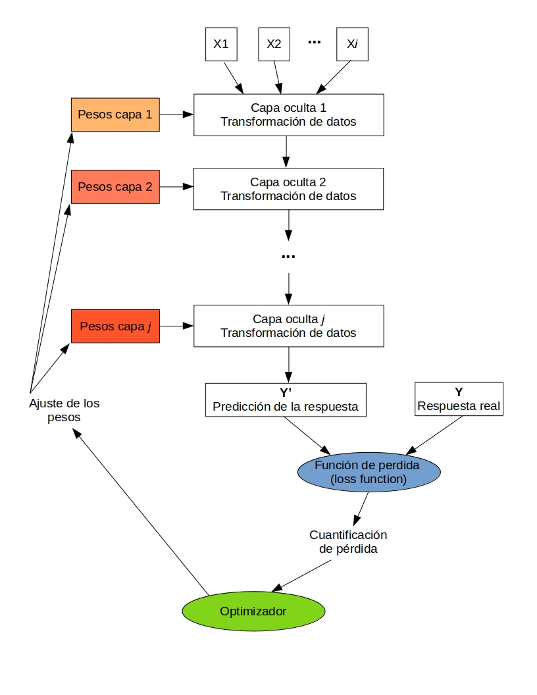
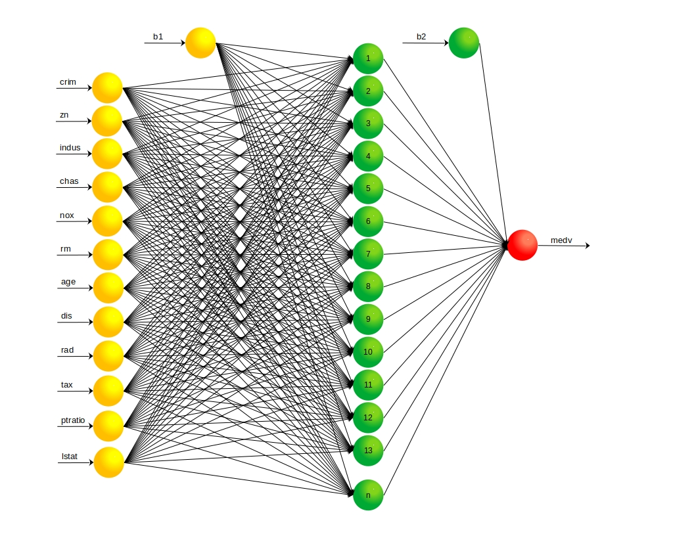

```{r echo=FALSE, message=FALSE, warning=FALSE}
library(tidyverse) # Librería para ordenamiento de arreglos de datos, incluye ggplot2
library(Metrics) # Librería para calculo de métricas de evaluación valores reales vs valores predichos
library(plotly) # gráficos interactivos
library(cowplot) # Grid de gráficos
library(reticulate) # hacer uso de python en R
library(keras) # 
library(tensorflow)
library(knitr) # Libería para crear tablas en archivos Knit html# gráficos interactivos
```

```{r echo=FALSE, message=FALSE, warning=FALSE}
# Carga de datos actualizados en la parte anterior
Train <- as.data.frame(read_csv("Train.csv", col_types = cols(chas = col_factor()
                                                , rad = col_factor())))
Test <- as.data.frame(read_csv("Test.csv", col_types = cols(chas = col_factor(), 
                                              rad = col_factor())))
RMSE_7 <- read_csv("RMSE_6.csv")
```

```{=html}
<center>
<h1>Parte 8: Redes Neuronales Artificiales</h1>
</center>
```
## Introducción

Las redes neuronales artificiales (RNA) tienen aplicación a las regresiones numéricas, R.Chollet, F., & Allaire, J. J en su libro Deep Learning with R, mencionan la aplicación de las RNA a una regresión numérica presentando un ejemplo con el dataset Boston, el mismo que se ha usado a lo largo del documento. El desarrollo de esta parte del se basa en el ejercicio que se encuentra en el capítulo 4, numeral 4.3 del libro en mención. La explicación del soporte matemático y el funcionamiento de los modelos RNA puede ser un poco extensa, el númeral [3.1.2.1 Redes Neuronales Artificiales](https://repositorio.escuelaing.edu.co/handle/001/1262) del documento enlazado presenta un resumen de esta información.

La base de una red neuronal es conocida como perceptón, de allí parte la arquitectura de una red neuronal, [THE ASIMOV INSTITUTE](https://www.asimovinstitute.org/wp-content/uploads/2019/04/NeuralNetworkZo19High.png) tiene publicado un cuadro interesante de los tipos de arquitecturas de redes neuronales artificiales. Para esta parte del documento se contemplan modelos de RNA tipo Deep Feed Forward (DFF). En cada perceptón (neurona) se desarrolla una operación matemática que se puede esquematizar así:

{width="496"}

Cada perceptón tiene $m$ entradas, las cuales son las variables independientes a las que se les asigna un peso $W$. Cada peso $W_i$ está multiplicado por el valor de la variable de entrada, en el perceptón se produce la suma de todos los pesos y las entradas, y finalmente el resultado de la sumatoria pasa por una función de transferencia. La sumatoria mencionada es una versión de una regresión lineal simple, no obstante, la aplicación de la función de transferencia es la que "activa" una no linealidad del modelo. Un modelo RNA tiene $j$ perceptones, bien sea conectados directamente con las variables independientes o con las salidas de otro percepton, en todo caso en cada $j$ percepton se desarrolla una operación similar (cambian los pesos, las entradas y en algunos casos la función de transferencia). El modelo, durante el entrenamiento, ajusta los pesos $W$ hasta que encuentra el menor error posible.

{width="433"}

El anterior es un esquema del funcionamiento de un modelo de RNA, no obstante, es necesario tener en cuenta que el modelo es mucho más complejo, incluye hiper-parámetros que no se mencionan a profundidad pero que son relevantes en los resultados del modelo (cantidad de perceptones por cada capa, tasa de aprendizaje del optimizador, entre otros).

Los modelos que se presentarán en este documentos se definen y entrenan bajo las librerías Keras y Tensorflow. Existen diferentes parámetros e hiper-parámetros que deben ser definidos en cada modelo, la modificación de uno solo puede generar diferencias relevantes en el resultado. Siguiendo algunas de las indicaciones de R.Chollet, F., & Allaire, J. J, algunos de estos parámetros e hiper-parámetros se mantendrán constantes:

1)  Función de activación: ReLu

2)  Algoritmo de optimización: RMSprop sin modificación de los valores por defecto

3)  Métrica de medición de pérdida: MSE

4 ) Métrica de comparación: MAE

Se modificarán:

1)  Cantidad de neuronas (perceptones) en cada capa oculta

2)  La cantidad de capas ocultas

La normalización de los datos de las variables independientes es un paso previo recomendado, al estandarizar las variables se reduce el costo computacional. La estandarización llevando la media a cero

### **8.1. Redes Neuronales de una capa oculta**

{width="574"}

n: representa la cantidad de neuronas en la capa oculta

#### 8.1.1 Modelo de 32 neuronas
